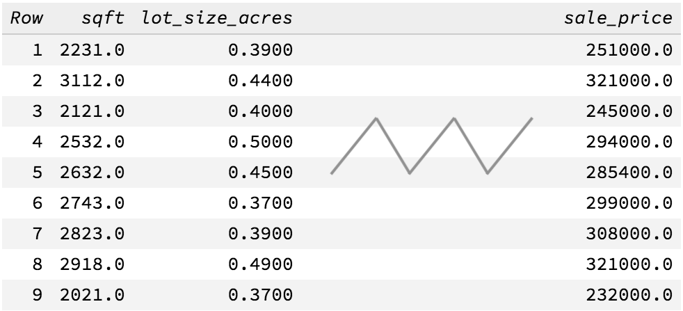

When you start doing some Machine Learning, you go through a batch-oriented process: you take a dataset, you build a Machine Learning model from this data, and you use this model to make some predictions on another dataset. Then, you want to repeat this process on streaming data, and this is where it can get confusing! Let's see what you can do in streaming and what you cannot do.

# Looking at a use case

To illustrate this article, let's take one of the most common use cases of Machine Learning: estimating prices of real estate. You have a dataset of **past observations**, giving you the characteristics and the selling price of some houses:

You can build a regression model so that, when there is a new house to sell, you can estimate what will be the selling price. E.g. a house of 2000 sqft with a lot of 0.5 acres might sell around $250,000.

The first mistake people make is to think we can update the model when we receive a new house to sell. We can't, because the new piece of data is an **unlabelled** element: we know the characteristics of the house, but we don't know its selling price (yet). It is only once the house has been sold that we can enrich our training dataset with a new record.

The second usual mistake is to think we should update the model every time we have a new labelled record (a house was sold and we know its selling price). Well, we _could_, but it is probably not a good idea to do so. Training a model may require doing some cross-validation, going through a grid-search to optimize our parameters, and we may even try multiple algorithms. All of this is makes the process very resource-intensive. It is also a good idea to have a human verify that the model performs as expected before using it in production. And who knows, the real estate market may be going through a bubble, and you may want to refine your dataset to only keep the last 3 months of data.

Basically, what I am trying to say is that **your Data Scientist should decide when to update the model**.

More generally speaking, when you update your model incrementaly, i.e. as you receive new training examples, we talk about [Online Machine Learning](https://en.wikipedia.org/wiki/Online_machine_learning). However, few algorithms allow that.

# Looking at technologies

To recap the point above:
- The training process should be done in batch, from time to time, with a fixed dataset, and will produce a model.
- A streaming application can use the model (without updating it), and we may need to update the application when a new model is produced.

Let's look at some popular options for building our models:
- [scikit-learn](http://scikit-learn.org/) and [Tensorflow](https://www.tensorflow.org/): two popular Python libraries.
- [Spark ML](https://spark.apache.org/docs/latest/ml-guide.html): a library built on top of Apache Spark.
- cloud-hosted Machine Learning services, such as [Google Cloud Machine Learning Engine](https://cloud.google.com/ml-engine/) or [AWS SageMaker](https://aws.amazon.com/sagemaker/).
- [H2O.ai](https://www.h2o.ai/): a mostly-Java based platform.

These are all great options to build a ML model, but let's say you want to use the model to make some predictions in realtime, as events arrive in Kafka, and your application is Java-based:
- scikit-learn and Tensorflow: since these are Python libraries, your best bet is to expose the model on an API, an call the API from your Java application.
- Spark ML: you will most likely have to use Spark Streaming, which comes with its set of challenges (high latency, complexity when updating an application, etc.).
- Cloud-hosted services: these are API-based, and therefore very easy to integrate, but latency might be too high if you need to make your predictions with a very low-latency.
- H2O.ai: this platform allows you to download the model as a POJO (a Java class) that you can integrate in your application. **This is what we are going to use in this post.**

